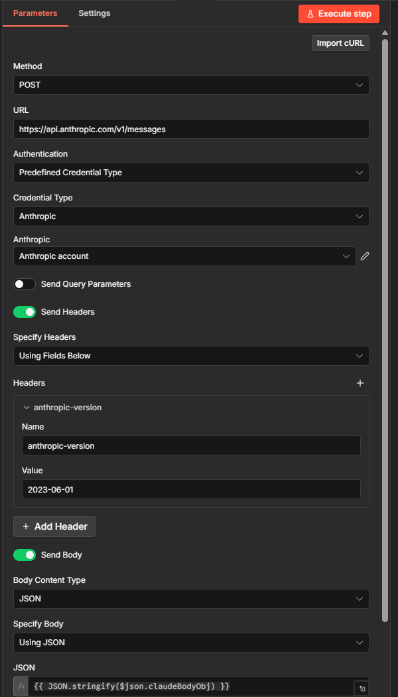
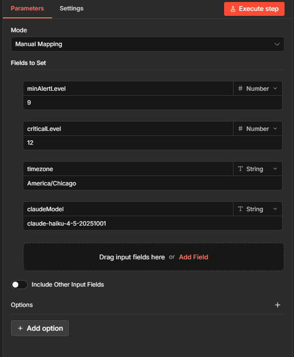
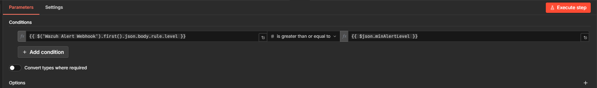
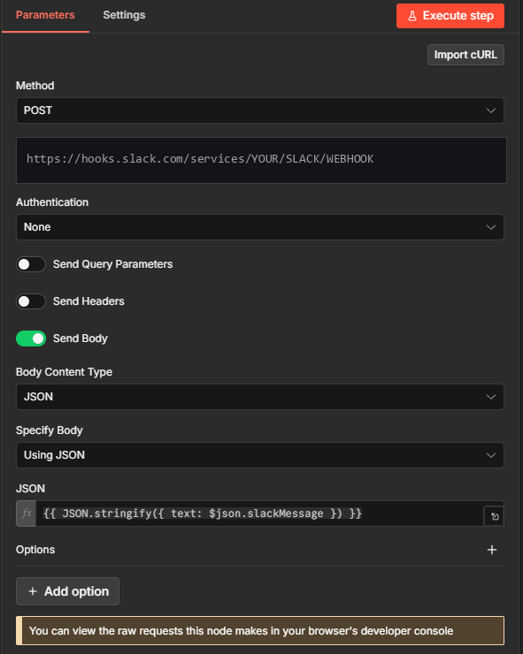

# Wazuh AI Security Analyzer

> An n8n workflow that turns every high-severity Wazuh alert into an AI-triaged Slack message with risk assessment, likely cause, and the exact shell commands to investigate. About **$0.001 per alert** with Claude Haiku.

[](https://youtu.be/74TzhvvWmfk) [](https://ageniuslabs.com) [](LICENSE)


*Real output from the live demo: a brute-force SSH attempt against an internal Proxmox node was correctly flagged as `MEDIUM, likely false positive` because the source was internal, with five investigation commands attached.*

---

## Why this exists

Your Wazuh SIEM fires hundreds of alerts a day. Most are noise. Some are real. Reading every one is impossible. Ignoring them is dangerous. Tuning them out kills the whole point of running a SIEM.

So this workflow puts an AI analyst in front of every high-severity alert. Webhook in, infrastructure-aware risk assessment out. Drop it in your Slack security channel and you read the answer, not the dashboards.

## What it does

1. Wazuh fires a webhook on any alert above your configured level (default level 10).
2. The workflow extracts the alert payload and ships it to your chosen LLM (Claude Haiku by default; OpenAI, local Ollama, anything works) along with an **infrastructure context block** that tells the model what is normal in YOUR network.
3. The model returns a structured analysis: risk level, one-line summary, likely cause, action items, and exact shell commands to investigate.
4. Formatted message lands in Slack (or Telegram, Teams, anywhere with an incoming webhook) within seconds of the original alert.

## Quick start

> **Setting up with an AI assistant?** Paste [`AI-SETUP-PROMPT.md`](AI-SETUP-PROMPT.md) into Claude / ChatGPT / Gemini and it will interview you through the deployment, including building the infrastructure-context block from your specific environment. Recommended.

1. **Import the workflow** into your n8n instance.
   ```bash
   # In n8n: Workflows > Import from File > select wazuh-ai-security-analyzer.workflow.json
   ```

2. **Configure three credentials** in n8n:
   - LLM API key (Anthropic, OpenAI, or your Ollama endpoint)
   - Slack incoming webhook URL
   - Wazuh webhook integration (configured below)

3. **Customize the infrastructure context block** in the `Config` node. Use [`infrastructure-context-template.md`](infrastructure-context-template.md) as the starting point. This is the piece that makes the AI analysis actually useful, do not skip it.

4. **Wire up Wazuh** to fire a webhook on alerts at or above the workflow's default level (9). Add to `/var/ossec/etc/ossec.conf`:
   ```xml
   <integration>
     <name>custom-n8n-webhook</name>
     <hook_url>https://YOUR-N8N-INSTANCE/webhook/wazuh-alert-ai-public</hook_url>
     <level>9</level>
     <alert_format>json</alert_format>
   </integration>
   ```
   Restart the Wazuh manager: `systemctl restart wazuh-manager`.

   The workflow `Config` node sets `minAlertLevel=9` and `criticalLevel=12` by default. Adjust both there to fit your noise tolerance.

5. **Test the chain end to end** with the included script:
   ```bash
   pip install paramiko
   python scripts/wazuh-bruteforce-test.py <your-test-target-ip>
   ```
   Within ~30 seconds you should see the AI-analyzed message land in Slack.

## What is in the workflow



Four logical sections, all documented inline in the workflow JSON:

| Section | Nodes | What it does |
|---|---|---|
| **Wazuh Incoming Alert Webhook** | Webhook trigger | Listens for Wazuh JSON payloads at `/webhook/wazuh-alert-ai-public` |
| **Configuration & Qualification** | Config + IF node | Sets alert thresholds, model choice, timezone. Filters out anything below `minAlertLevel` (default 9). |
| **Extract & Analyze** | Extract + LLM call | Pulls the alert details, builds the infrastructure-context-aware prompt, calls the LLM. |
| **Format & Notify** | Format + Slack/Telegram/Teams | Builds the human-readable message and posts it. |

### Config node



Single source of truth for thresholds, LLM provider, model, timezone. Change once, applies everywhere.

### Extract & Analyze



The infrastructure context block lives here. The prompt is the secret sauce. See [`infrastructure-context-template.md`](infrastructure-context-template.md).

### Slack output



Drop-in for any incoming-webhook channel. Telegram and Teams variants are documented inline in the node's sticky notes.

## The whole workflow with inline docs


Every node has a sticky note explaining what it does, what to configure, and where to find the relevant documentation. Setup is meant to be self-serve.


## Live demo


Full walkthrough with a live brute-force attack triggering the chain end to end:

▶ **[https://youtu.be/74TzhvvWmfk](https://youtu.be/74TzhvvWmfk)**

## Repo contents

```
.
├── wazuh-ai-security-analyzer.workflow.json   # The n8n workflow, import-ready
├── infrastructure-context-template.md         # System-prompt block (customize this)
├── AI-SETUP-PROMPT.md                         # Companion prompt for AI-assisted deployment
├── scripts/
│   └── wazuh-bruteforce-test.py               # End-to-end pipeline test
├── screenshots/                               # Workflow + Slack output reference
├── README.md
└── LICENSE                                    # MIT
```

## Who built this

[Michael Frostbutter](https://ageniuslabs.com), founder of Agenius AI Labs. 25+ years in network engineering and technology operations. Built this for my own home lab before packaging it for anyone else who wants to ship the same thing.

## Contributing

Issues and PRs welcome. Particularly interested in:
- Telegram / Teams / Discord notification variants tested in production
- Multi-tenant context-block routing patterns for MSPs
- Local Ollama model recommendations and quality comparisons
- Wazuh rule packs that pair well with this workflow

## License

MIT, see [LICENSE](LICENSE). Use it however you want.
